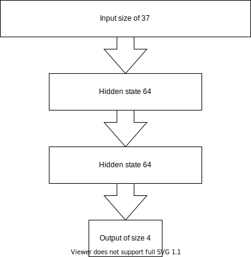
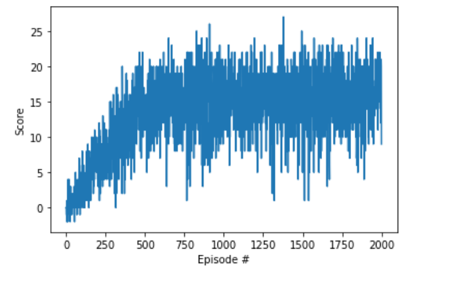

# Report

## Learning Algorithm

For this project , I have used and modified the code for Deep Q Network (DQN) from the lectures.

In DQN, we minimize the loss given by the minimizing the meas-squared error between the off-policy estimate of target state-value function and its approximate Q function

$\mathcal{L}(\theta) = \mathbb{E}_{(s, a, r, s') \sim U(D)} \Big[ \big( r + \gamma \max_{a'}  \textcolor{blue}{Q(s', a'; \theta^{-})}- Q(s, a; \theta) \big)^2 \Big]$

$\theta^{-}$ and $\theta$ are the target and approximate Q function parameters and the experience relay stores the samples  $(s, a, r, s')$ in a buffer,  which are sampled using the uniform distribution $U(D)$ 

The model used for the agent:

The hyperparameters used:

- Batch size of 64
- Discount factor of 0.99
- Tau ($\tau$) which updated the target Q function is 1e-3
- Learning rate 5e-4
- Update every 4 steps

## Plot of Rewards

The environment was solved by episode 500 as can be seen in `Navigation.ipynb`

## Trained agent behavior

## Ideas for Future Work

- Will extend the the DQN to dueling DQN and also solve the learning from pixels challenge.

- Invest in more time to explore different hyper-parameters and ablations studies 